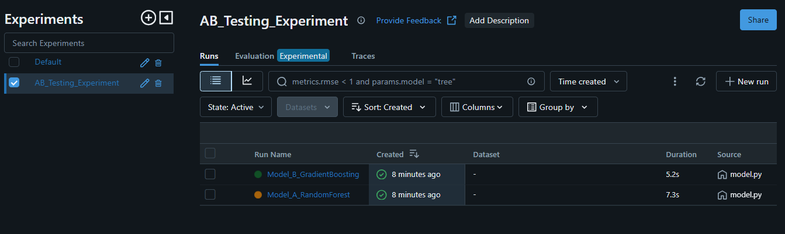
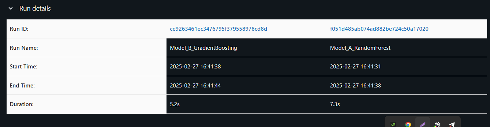
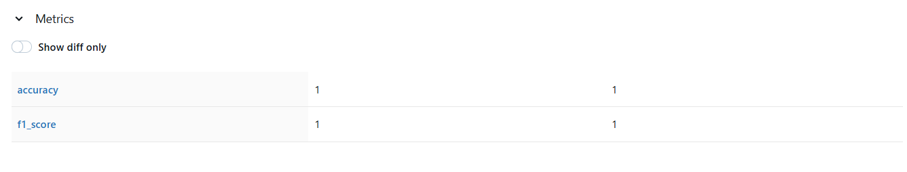

# A Comprehensive Guide to A/B Testing in Machine Learning

## What is A/B Testing?

A/B testing, also known as split testing, is a method of comparing two versions of a product, feature, or model to determine which one performs better. It involves randomly assigning users, data points, or traffic into two groups: the control group (A) and the variant group (B). By analyzing how each group performs against defined metrics, A/B testing enables data-driven decision-making.

### Key Concepts of A/B Testing
1. **Control and Variant Groups:**
   - **Control Group (A):** Represents the current or baseline version.
   - **Variant Group (B):** Represents the new or experimental version.

2. **Randomization:**
   - Ensures that the assignment of samples to groups is unbiased.

3. **Metrics and KPIs:**
   - Predefine success metrics such as accuracy, conversion rates, or F1 score.

4. **Statistical Significance:**
   - Use statistical methods to ensure that observed differences are not due to chance.

5. **Duration and Sample Size:**
   - Run the test long enough to collect a representative sample.

6. **Analysis:**
   - Compare the performance of A vs. B using the defined metrics.

## How to Implement A/B Testing in a Machine Learning System

### Step-by-Step Approach

1. **Define the Objective:**
   - Establish a clear hypothesis, e.g., "Model B will improve accuracy by 5% over Model A."

2. **Prepare the Dataset:**
   - Use the same dataset for both models to ensure fairness in comparison.

3. **Build and Train Models:**
   - Develop Model A (e.g., a baseline model) and Model B (e.g., an improved model).

4. **Experiment Tracking with MLflow:**
   - Log models, metrics, and parameters in MLflow.
```python
import mlflow
from sklearn.datasets import load_iris
from sklearn.ensemble import RandomForestClassifier
from sklearn.model_selection import train_test_split
from sklearn.metrics import accuracy_score

# Load dataset
X, y = load_iris(return_X_y=True)
X_train, X_test, y_train, y_test = train_test_split(X, y, test_size=0.2, random_state=42)

# Model A
with mlflow.start_run(run_name="Model_A"):
    model_a = RandomForestClassifier(n_estimators=50)
    model_a.fit(X_train, y_train)
    accuracy_a = accuracy_score(y_test, model_a.predict(X_test))
    mlflow.log_metric("accuracy", accuracy_a)

# Model B
with mlflow.start_run(run_name="Model_B"):
    model_b = RandomForestClassifier(n_estimators=100)
    model_b.fit(X_train, y_train)
    accuracy_b = accuracy_score(y_test, model_b.predict(X_test))
    mlflow.log_metric("accuracy", accuracy_b)
```

5. **Compare Model Performance:**
   - Use MLflow's UI to visually compare the metrics and choose the best model.

**I have implemented A/B testing by runnig two different model on iris dataset, run gradient boosting and random forest algorithm  and compare f1 score and accuracy**





## Conclusion
A/B testing is a powerful method to validate model performance in a structured and data-driven manner. By leveraging tools like MLflow, machine learning practitioners can effectively track experiments, compare results, and make informed decisions about deploying the best-performing models into production.

